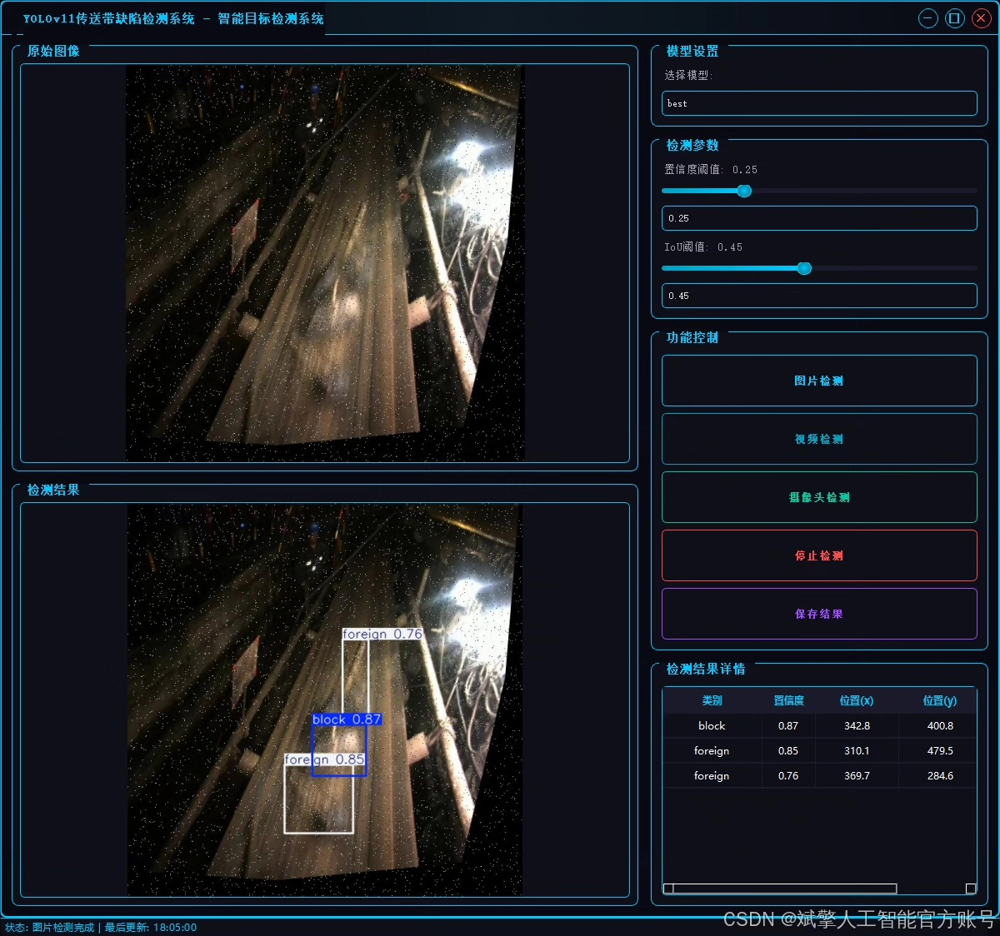
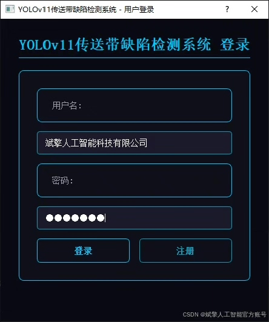
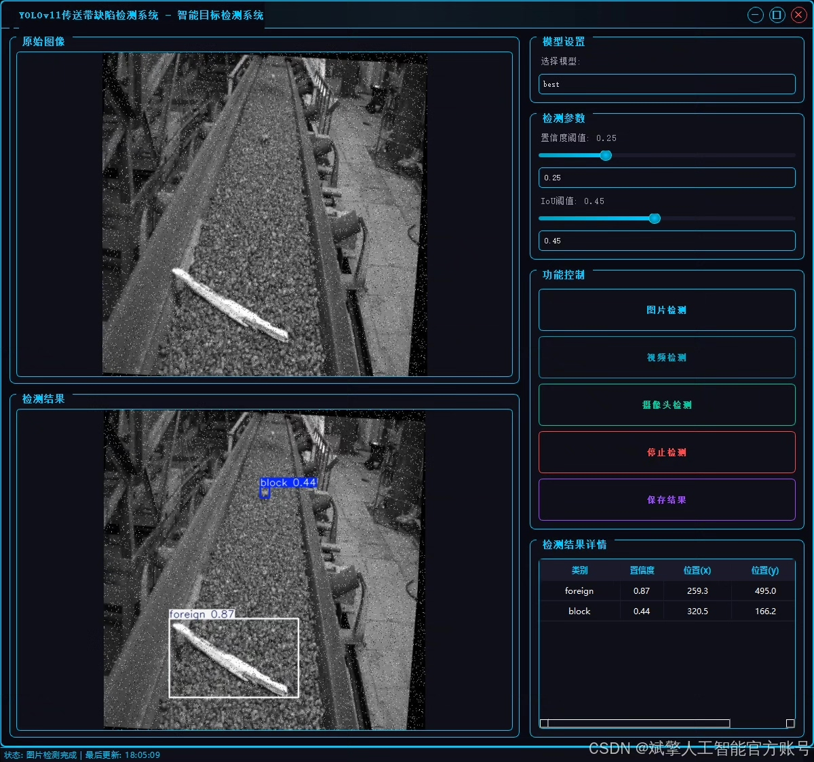
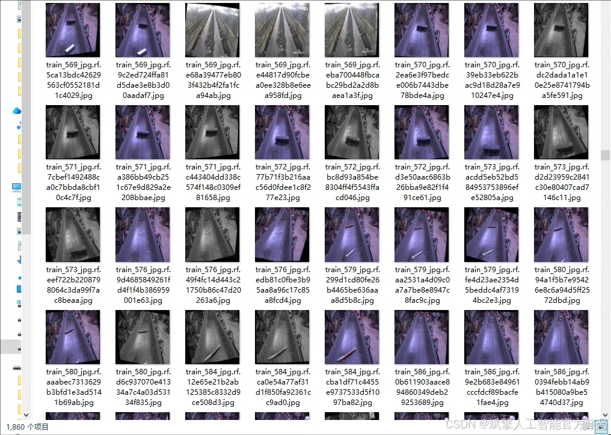
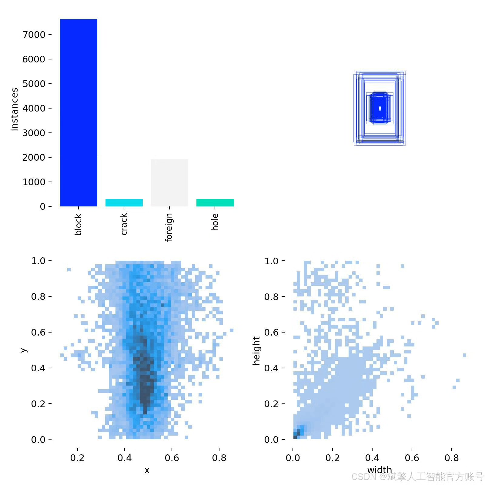
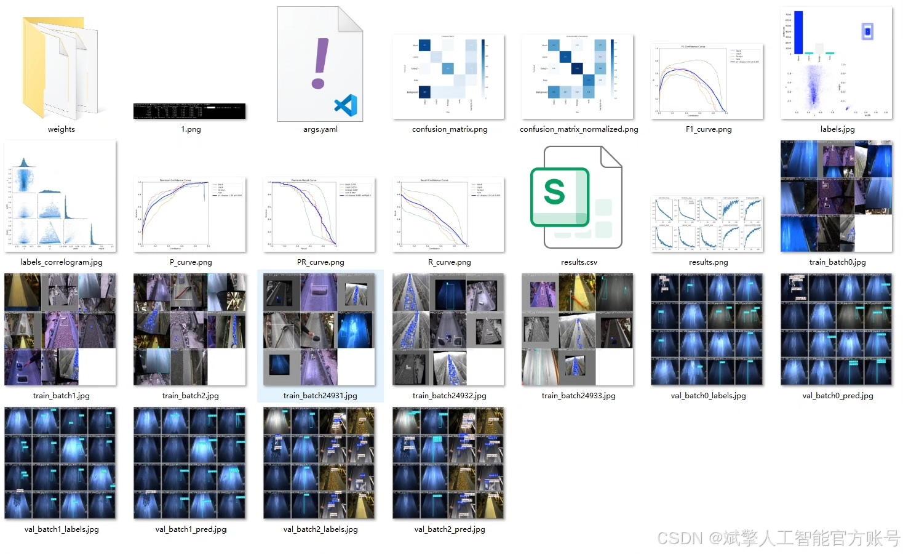
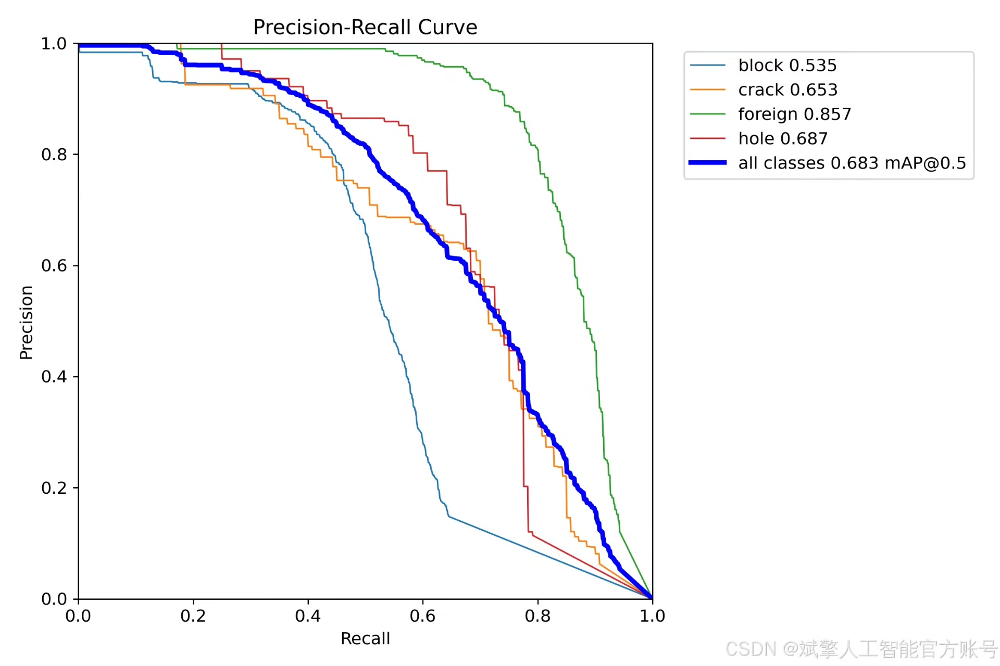
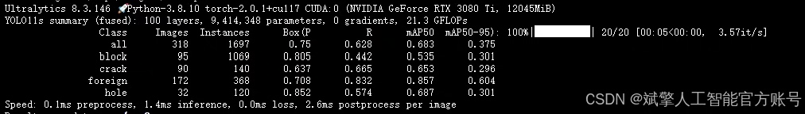
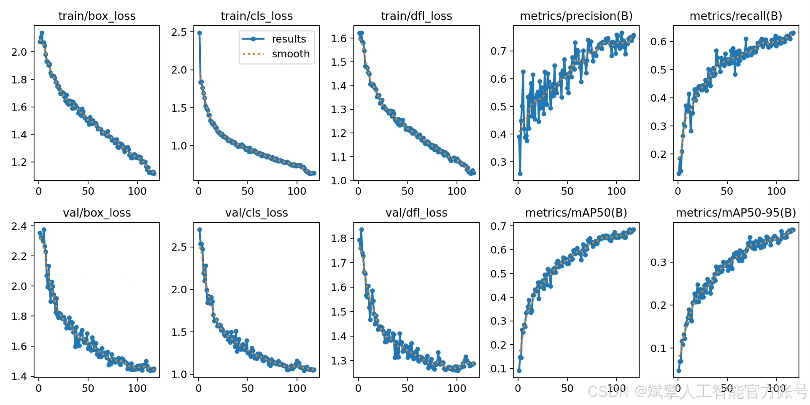

# YOLOv11 defect recognition system

## Body

YOLOv11 Defect Detection System Based on Deep Learning YOLOv11's conveyor belt defect recognition detection system (YOLOv11+YOLO dataset + UI interface + login registration interface + Python project source code + model)

nc: 4 classes,
Name: ['block', 'crack', 'foreign', 'hole'],
Dataset quantity: training set 1860 images, validation set 318 images, test set 167 images.

✅ User login registration: Support password detection and security verification.

✅ Three detection modes: based on the YOLOv11 model, support image, video and real-time camera three detection, accurate recognition of targets.

✅ Dual screen comparison: display original images and detection results on the same screen.

✅ Data visualization: real-time table displaying the category, confidence and coordinates of detected targets.

✅ Intelligent parameter adjustment: provide a confidence slide bar to dynamically optimize detection accuracy, adapt to different scene requirements.

✅ Sci-fi style interactive interface: dark theme combined with dynamic light effects, reduce visual fatigue, improve operational experience.

## Images

## Payment

Here is a pay link on Stripe ( https://buy.stripe.com/3cs8yP7sY87d0vu9AB ). Please contact me lonlonago@foxmail.com after funding $89, and I will send you a complete data files , thank you!

